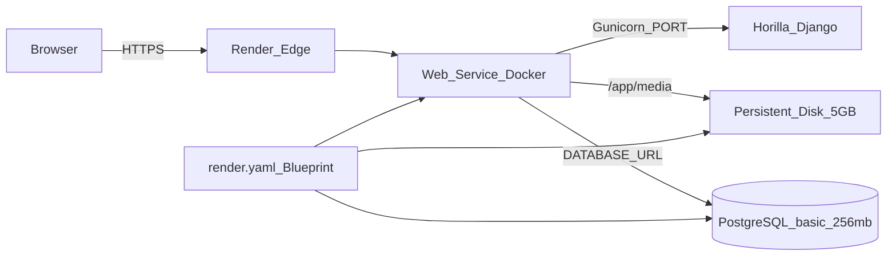

# Horilla HRMS — One-Click Render Deployment Guide

This document is a **self-contained, copy-paste-ready runbook** for deploying [Horilla HRMS](https://github.com/horilla-opensource/horilla) to [Render](https://render.com) using a Blueprint (`render.yaml`). It encodes every fix discovered during a production deployment so another AI (or human) can deploy in **one shot without repeating known mistakes**.

**Target outcome:** HTTPS web app, managed PostgreSQL with backups, persistent media storage, white-labelled branding, and a documented database-init password.

---

## Table of contents

1. [Architecture](#architecture)
2. [Prerequisites](#prerequisites)
3. [Critical lessons (read before deploying)](#critical-lessons-read-before-deploying)
4. [Required files (exact contents)](#required-files-exact-contents)
5. [One-shot deployment steps](#one-shot-deployment-steps)
6. [Database initialization and DB_INIT_PASSWORD](#database-initialization-and-db_init_password)
7. [White labelling](#white-labelling)
8. [Verification checklist](#verification-checklist)
9. [Troubleshooting](#troubleshooting)
10. [Cost estimate](#cost-estimate)
11. [Reference: live deployment record](#reference-live-deployment-record)

---

## Architecture

Horilla is a Django 4.x app (Python 3.10) that requires:

| Requirement | Why |
|---|---|
| **PostgreSQL** | Production database (SQLite is dev-only) |
| **Single web instance** | `django_apscheduler` must not run on multiple instances |
| **Persistent disk for `/app/media`** | User uploads, company logos, documents |
| **Gunicorn + WhiteNoise** | Production WSGI + static files |
| **`makemigrations` before `migrate`** | Horilla does not ship all migration files in the repo |

### Render components



| Component | Render plan | Purpose |
|---|---|---|
| Web service | Starter (Docker) | Runs Gunicorn, 1 instance |
| PostgreSQL | Basic 256 MB | Managed DB, daily backups |
| Persistent disk | 5 GB @ `/app/media` | Uploaded files survive redeploys |

**Estimated cost:** ~$14/month (Starter web + Basic Postgres + disk).

---

## Prerequisites

Before starting, ensure:

1. **GitHub fork** of Horilla (branch `1.0` or `main`) under your account, e.g. `your-org/horilla-deploy`.
2. **Render account** with a workspace created ([render.com](https://render.com)).
3. **GitHub connected** to Render (OAuth) so Render can pull the repo.
4. The four deployment files from [Required files](#required-files-exact-contents) committed and pushed to the fork's default branch.

---

## Critical lessons (read before deploying)

These three failures occur on a naive Horilla + Render deploy. **Do not skip the fixes below.**

### 1. Never use a multi-line `dockerCommand` in `render.yaml`

**Symptom:** Logs show `command not found` (exit 127), HTTP 502.

```
bash: line 1: python3 manage.py migrate --noinput && python3 manage.py collectstatic ...: command not found
```

**Cause:** Render treats the entire folded YAML string as a single binary name.

**Fix:** Use a startup script and a one-line command:

```yaml
dockerCommand: bash /app/scripts/render-start.sh
```

### 2. Always run `makemigrations` before `migrate`

**Symptom:** App starts but requests fail with:

```
psycopg2.errors.UndefinedTable: relation "base_dynamicemailconfiguration" does not exist
```

**Cause:** Horilla's upstream `entrypoint.sh` runs `makemigrations` then `migrate`. The repo does not include all migration files; they are generated at startup.

**Fix:** `scripts/render-start.sh` must call `makemigrations --noinput` before `migrate --noinput` (see exact script below).

### 3. Blueprint manual deploy does not re-sync all settings

**Symptom:** New commits deploy but the service still runs the old broken start command.

**Cause:** "Manual Deploy → Deploy latest commit" rebuilds the Docker image but may **not** update the stored **Docker Command** field from `render.yaml`.

**Fix:** After changing `dockerCommand` in `render.yaml`, verify in Render Dashboard → service → **Settings → Deploy → Docker Command** that it reads:

```
bash /app/scripts/render-start.sh
```

If it still shows the old multi-line command, edit it manually and save (triggers redeploy).

---

## Required files (exact contents)

Add or verify these four files in the repo root (paths relative to repo root).

### 1. `render.yaml`

Create at repo root. This is the Render Blueprint.

```yaml
databases:
  - name: horilla-db
    plan: basic-256mb
    databaseName: horilla
    user: horilla

services:
  - type: web
    name: horilla-hrms
    runtime: docker
    plan: starter
    dockerfilePath: ./Dockerfile
    dockerContext: .
    healthCheckPath: /login
    numInstances: 1
    disk:
      name: horilla-media
      mountPath: /app/media
      sizeGB: 5
    dockerCommand: bash /app/scripts/render-start.sh
    envVars:
      - key: DATABASE_URL
        fromDatabase:
          name: horilla-db
          property: connectionString
      - key: SECRET_KEY
        generateValue: true
      - key: DEBUG
        value: "False"
      - key: ALLOWED_HOSTS
        value: horilla-hrms.onrender.com,.onrender.com
      - key: CSRF_TRUSTED_ORIGINS
        value: https://horilla-hrms.onrender.com
      - key: TIME_ZONE
        value: Asia/Kolkata
      - key: DB_INIT_PASSWORD
        generateValue: true
      - key: WHITE_LABELLING
        value: "True"
```

**Notes for the deploying AI:**

- **`numInstances: 1`** is mandatory (APScheduler).
- **`ALLOWED_HOSTS`** includes `.onrender.com` as a catch-all so auto-generated service names (e.g. `horilla-7ir6.onrender.com`) work if Render suffixes the name due to a collision.
- After deploy, if Render assigns a specific hostname, add it explicitly to `ALLOWED_HOSTS` and `CSRF_TRUSTED_ORIGINS` and redeploy.
- Change `TIME_ZONE` to your region if needed (e.g. `America/New_York`).
- **`DB_INIT_PASSWORD`** and **`SECRET_KEY`** are auto-generated by Render; save `DB_INIT_PASSWORD` immediately after first deploy (see [Database initialization](#database-initialization-and-db_init_password)).

### 2. `scripts/render-start.sh`

Create the `scripts/` directory if it does not exist.

```bash
#!/bin/bash
set -euo pipefail

python3 manage.py makemigrations --noinput
python3 manage.py migrate --noinput
python3 manage.py collectstatic --noinput
exec gunicorn --bind "0.0.0.0:${PORT:-8000}" horilla.wsgi:application
```

**Do not** use the upstream `entrypoint.sh` as the Render start command. That script creates a default `admin`/`admin` user, which is insecure for production.

### 3. `Dockerfile` (two required edits)

Use the upstream Horilla Dockerfile as a base, then ensure the **runtime stage** includes:

1. **`libcairo2`** — required for PDF/report generation.
2. **`chmod +x`** on `scripts/render-start.sh`.

Full production Dockerfile:

```dockerfile
FROM python:3.10-slim-bullseye AS builder

ENV PYTHONUNBUFFERED=1

RUN apt-get update && apt-get install -y --no-install-recommends libcairo2-dev gcc && rm -rf /var/lib/apt/lists/*

WORKDIR /app/

COPY requirements.txt .
RUN pip install --no-cache-dir --prefix=/install -r requirements.txt

FROM python:3.10-slim-bullseye AS runtime

ENV PYTHONUNBUFFERED=1

RUN apt-get update && apt-get install -y --no-install-recommends libcairo2 && rm -rf /var/lib/apt/lists/*

WORKDIR /app/

COPY --from=builder /install /usr/local

COPY . .

RUN chmod +x /app/entrypoint.sh /app/scripts/render-start.sh

EXPOSE 8000

CMD ["python3", "manage.py", "runserver"]
```

Render overrides `CMD` via `dockerCommand` in `render.yaml`; the default `runserver` CMD is only a fallback.

### 4. `horilla/horilla_apps.py` (white labelling flag)

Near the bottom of the file, replace the hardcoded flag with an environment variable:

```python
WHITE_LABELLING = settings.env.bool("WHITE_LABELLING", default=False)
```

When `WHITE_LABELLING=True` (set in `render.yaml`), the app uses the **Company** record's name and logo instead of "Horilla" branding (login page, titles, emails, favicons). Logic lives in `base/context_processors.py` → `white_labelling_company`.

---

## One-shot deployment steps

Follow these steps in order. An AI agent should execute all steps without skipping verification.

### Step 1 — Commit and push deployment files

Ensure these files exist and are on the default branch (`main`):

- `render.yaml`
- `scripts/render-start.sh`
- `Dockerfile` (with libcairo2 + chmod fixes)
- `horilla/horilla_apps.py` (WHITE_LABELLING env var)

```bash
git add render.yaml scripts/render-start.sh Dockerfile horilla/horilla_apps.py
git commit -m "Add Render Blueprint and production startup for Horilla HRMS"
git push origin main
```

### Step 2 — Create Blueprint on Render

1. Open [Render Dashboard](https://dashboard.render.com).
2. Click **New → Blueprint**.
3. Connect the GitHub repo (e.g. `your-org/horilla-deploy`).
4. Blueprint name: e.g. `horilla-production`.
5. Review resources: 1 web service, 1 Postgres DB, 1 disk.
6. Click **Apply** / **Deploy Blueprint**.

**Service name collision:** If the name `horilla-hrms` is taken, Render may assign a suffixed name (e.g. `horilla-7ir6`). The `.onrender.com` catch-all in `ALLOWED_HOSTS` allows this to work. Note the actual URL from the dashboard.

First deploy takes **5–10 minutes** (Docker build + migrations).

### Step 3 — Verify Docker Command on Render

After Blueprint creation:

1. Go to **Web Service → Settings → Deploy**.
2. Confirm **Docker Command** is exactly:

   ```
   bash /app/scripts/render-start.sh
   ```

3. If it shows a long `bash -c "python3 manage.py migrate ..."` string, **edit it** to the script path above and **Save** (triggers redeploy).

### Step 4 — Wait for deploy to go live

Poll until healthy:

```bash
curl -sL -o /dev/null -w "%{http_code} %{url_effective}\n" \
  https://YOUR-SERVICE.onrender.com/login
```

Expected: `200` at `https://YOUR-SERVICE.onrender.com/login/` (301 redirect from `/login` is normal).

If HTTP 502 persists for more than 10 minutes after deploy, check [Troubleshooting](#troubleshooting).

### Step 5 — Save DB_INIT_PASSWORD immediately

**Do this before closing the Render dashboard.**

1. Web Service → **Environment**.
2. Find **`DB_INIT_PASSWORD`** → click reveal (eye icon).
3. Copy the full value **including any trailing `=`**.
4. Store it securely (password manager, team vault, or the [Reference section](#reference-live-deployment-record) below for this fork).

You will need this password once on the Horilla **Initialize Database** screen.

### Step 6 — Initialize database and create admin

1. Open `https://YOUR-SERVICE.onrender.com/login/`.
2. Click **Initialize Database** (or follow the first-run flow).
3. Enter **`DB_INIT_PASSWORD`** when prompted for "Database authentication password".
4. Complete the wizard: create company, departments, and **real admin user** (do not use default `admin`/`admin`).

### Step 7 — Enable white labelling (company branding)

1. Log in as admin.
2. Go to **Settings → Company** (or **Base → Company**).
3. Edit the HQ company:
   - Set **company name** (replaces "Horilla" in titles and emails).
   - Upload **logo/icon** (replaces Horilla logo on login, sidebar, favicon).

`WHITE_LABELLING=True` is already set via `render.yaml`; branding comes from the Company record.

---

## Database initialization and DB_INIT_PASSWORD

### What is DB_INIT_PASSWORD?

Horilla uses `DB_INIT_PASSWORD` (from `horilla/horilla_settings.py`) to gate the one-time **Initialize Database** flow on `/login/`. It prevents unauthorized database seeding on a fresh install.

In this deployment, Render auto-generates it:

```yaml
- key: DB_INIT_PASSWORD
  generateValue: true
```

### How to retrieve it later

Render Dashboard → **Web Service** → **Environment** → **`DB_INIT_PASSWORD`** → reveal.

It remains in Environment for the lifetime of the service. You only need it for the initial setup unless you re-initialize the database.

### Important

- Copy the password **exactly** (base64-like strings often end with `=`).
- Do **not** commit `DB_INIT_PASSWORD` to git.
- Do **not** use the upstream Docker `entrypoint.sh` default admin (`admin`/`admin`) in production.

---

## White labelling

### How it works

| Setting | Location | Effect |
|---|---|---|
| `WHITE_LABELLING=True` | `render.yaml` env var → `horilla/horilla_apps.py` | Enables white-label mode |
| Company name + icon | Settings → Company in the app UI | Replaces Horilla branding |

When enabled, templates use `white_label_company_name` and `white_label_company.icon` from the context processor in `base/context_processors.py`.

### What changes

- Login page logo and title
- Browser tab title and favicon
- Email footers and headers
- Dashboard branding

### What may still say "Horilla"

A few strings are hardcoded in upstream templates (database init wizard, some error pages). These are cosmetic and do not affect day-to-day HRMS use after initialization.

---

## Verification checklist

Run after deploy and after database initialization.

| Check | Command / action | Expected |
|---|---|---|
| Login page loads | `curl -sL https://SERVICE.onrender.com/login \| grep -o '<title>[^<]*</title>'` | `<title>Login - ... Dashboard</title>` |
| HTTPS / security | `curl -sI https://SERVICE.onrender.com/login/` | `strict-transport-security` header present |
| DEBUG off | Environment → `DEBUG` | `False` |
| Postgres connected | Logs on startup | No database connection errors; migrations complete |
| Disk mounted | Dashboard → Disk | 5 GB disk attached at `/app/media` |
| Single instance | Dashboard → Scaling | 1 instance |
| White labelling env | Environment → `WHITE_LABELLING` | `True` |
| Docker command | Settings → Docker Command | `bash /app/scripts/render-start.sh` |
| Admin login | Browser | Can log in with admin created during init |
| Company logo | Settings → Company | Logo appears on login page after upload |

---

## Troubleshooting

| Symptom | Likely cause | Fix |
|---|---|---|
| HTTP 502, log: `command not found` (exit 127) | Multi-line or wrong `dockerCommand` | Set Docker Command to `bash /app/scripts/render-start.sh` in Settings; ensure script exists and is executable in Dockerfile |
| HTTP 502, no command error | Deploy still building or crashed on migrate | Check deploy logs; confirm Postgres is available |
| `UndefinedTable: base_dynamicemailconfiguration` | Missing `makemigrations` before `migrate` | Update `scripts/render-start.sh` to run `makemigrations --noinput` first; redeploy |
| Fix commits pushed but behavior unchanged | Manual deploy did not update Docker Command | Edit Docker Command in Settings manually; or re-sync Blueprint |
| Auto-deploy did not trigger | Blueprint-managed service may not auto-deploy on every push | Manual Deploy → Deploy latest commit |
| 301 on `/login` but 404/502 on `/login/` | Service not fully live yet | Wait 2–5 min; check Events tab |
| CSRF error on login | `CSRF_TRUSTED_ORIGINS` missing actual URL | Add `https://YOUR-SERVICE.onrender.com` to env var; redeploy |
| DisallowedHost | Hostname not in `ALLOWED_HOSTS` | Add hostname or rely on `.onrender.com` catch-all |
| "Database authentication password" rejected | Wrong or truncated `DB_INIT_PASSWORD` | Re-copy from Environment tab including trailing `=` |
| Horilla logo still visible | White labelling off or no company logo | Confirm `WHITE_LABELLING=True`; upload logo under Settings → Company |
| PDF/report generation fails | Missing cairo library | Confirm `libcairo2` in Dockerfile runtime stage |

---

## Cost estimate

| Resource | Plan | Approx. monthly |
|---|---|---|
| Web service | Starter | ~$7 |
| PostgreSQL | Basic 256 MB | ~$6 |
| Persistent disk | 5 GB | ~$1 |
| **Total** | | **~$14** |

Render free tier is not suitable for production (DB expires, web spins down).

---

## Reference: live deployment record

Record for the deployment that validated this guide. **Update this section** when deploying a new instance.

| Field | Value |
|---|---|
| GitHub repo | `vizsoftglobal/horilla-deploy` (branch `main`) |
| Render service name | `horilla-7ir6` |
| Public URL | `https://horilla-7ir6.onrender.com` |
| Postgres service | `horilla-db-7ir6` |
| Blueprint name | `horilla-production` |
| **`DB_INIT_PASSWORD`** | `9dJnoTYqh+bOy53ifrq7ZAepB8sC6gjE2MRYu8Paw4A=` |
| `WHITE_LABELLING` | `True` |
| Docker Command | `bash /app/scripts/render-start.sh` |
| Last known good commit | `e2706b61` (white labelling + env var support) |

> **Security note:** `DB_INIT_PASSWORD` is listed here because the operator requested it be remembered for this deployment. For new deployments, Render generates a **new** value — always copy it from the Environment tab after first deploy.

---

## Quick reference for AI agents

**Minimum success path:**

1. Ensure 4 files match [Required files](#required-files-exact-contents).
2. Push to GitHub → Render New Blueprint → Apply.
3. Verify Docker Command = `bash /app/scripts/render-start.sh`.
4. Save `DB_INIT_PASSWORD` from Environment tab.
5. Poll `/login/` until HTTP 200.
6. Initialize database at `/login/` with saved password.
7. Set company name + logo for white labelling.
8. Run [Verification checklist](#verification-checklist).

**Never do:**

- Multi-line `dockerCommand` with `&&` chains in `render.yaml`
- `migrate` without `makemigrations` first
- Multiple web instances
- Default `admin`/`admin` from upstream `entrypoint.sh`
- Commit secrets to git

---

*Document version: 1.0 — validated against Render deployment June 2026.*
